::: {.column-screen}
::: {.hero}

  UBC Master of Data Science Capstone · DFO Canada
  
  <h1>Chinook Salmon Run Reconstruction Application</h1>

  

  Streamlining a Data Science Workflow for Fisheries Management
  

  

    Nicole Link · Michael Oyatsi · Claire Saunders
  

:::
:::
## Project Overview

This application was developed as a capstone project in the Master of Data Science program at the University of British Columbia in collaboration with **Fisheries and Oceans Canada (DFO)**.

Our team of three developed an interactive application to support the exploration, analysis, and reporting of Chinook salmon returning to Pacific Fisheries Management Areas for annual reporting requirements. The application brings together biological data processing, data pipeline automation, interactive visualization, and data infilling tools into a single workflow.

The application and its supporting workflows were handed off to DFO at the completion of the project. The full project repository is private, and the application is securely deployed within DFO's Virtual Private Network for access by government employees. This page provides a visual overview of the application's functionality using screenshots that have been approved for public viewing.

## Architecture and Deployment

The application was developed and deployed within DFO's secure infrastructure. Our team worked with DFO IT to establish a pre-configured **Ubuntu container environment**, into which we cloned the project repository and developed and ran the application. The project used an **R Project** and **renv** for R package management and reproducibility, allowing the required R packages and dependencies to be managed consistently within the development environment.

The application was deployed from the container using **Shiny**, with DFO IT supporting the deployment and network configuration. DFO employees could access the application through an internal URL while connected to the organization's secure **Virtual Private Network (VPN)**.

A **Samba share** was also established in collaboration with DFO IT to provide a shared location for application data and outputs. DFO users could map the shared location on their local computers, allowing them to provide new data to the application's workflow and retrieve outputs generated by the application.

The resulting architecture connected DFO users, shared data storage, the Shiny application, and its processing environment. Below is a diagram of the overall application architecture.

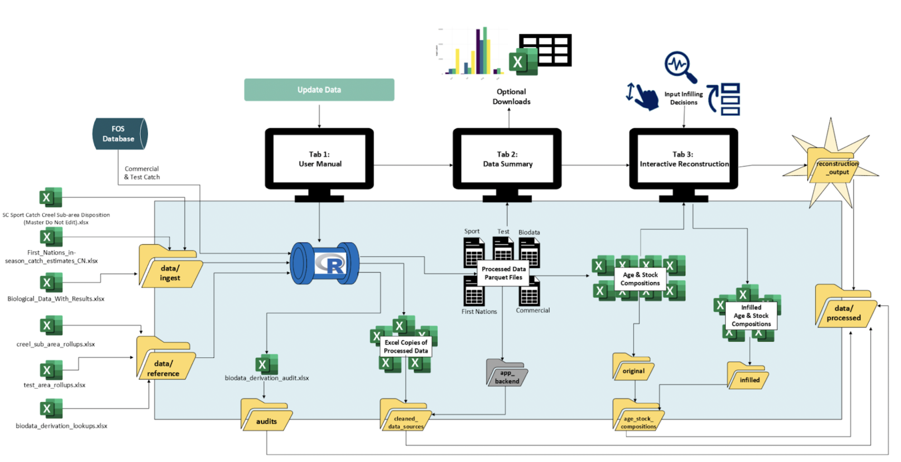

## Application Walkthrough

### Tab 1 — Data Pipeline

Tab 1 provides user instructions and an interface for managing and monitoring the application's data pipeline. Users can access the application landing page, initiate a data pipeline update, and receive confirmation when the update has completed successfully.

#### Landing Page

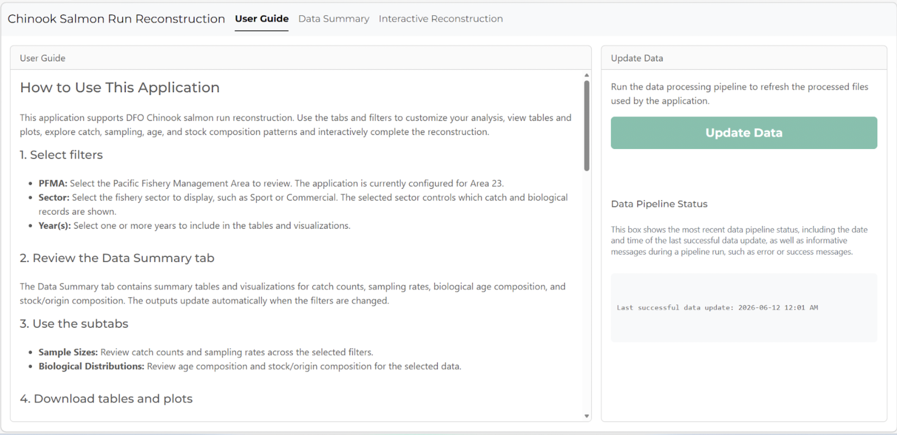

The landing page provides instructions for using the application and allows users to select **Update Data** to initiate a refresh of the underlying data sources.

#### Data Pipeline Update

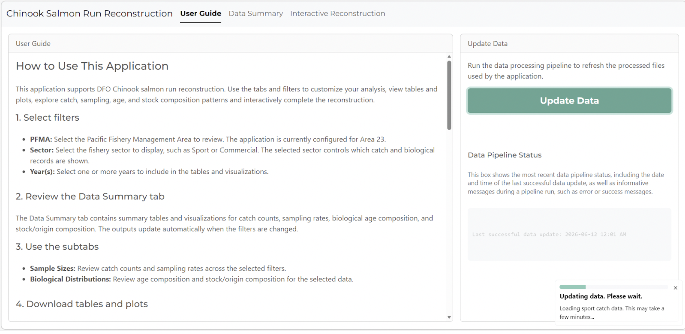

When the data pipeline is triggered, the application provides status messages in real time so users can monitor the progress of the update.

#### Successful Data Update

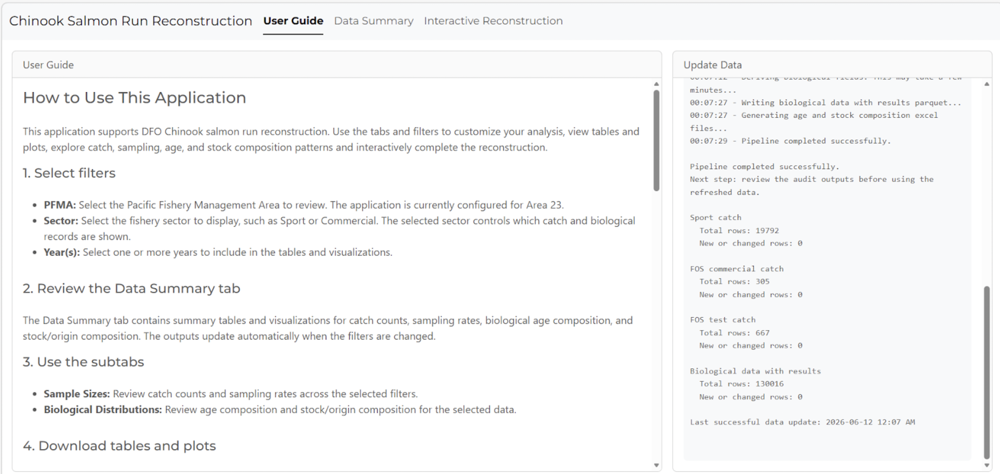

Once the update is complete, the application displays a confirmation message along with a summary of newly added data points for each reporting sector.

---

### Tab 2 — Data Exploration

Tab 2 provides interactive tools for exploring biological and sampling data. Users can examine sample sizes, view and download summary tables, compare multiple years, adjust sampling rate options, and investigate biological distributions across different dimensions.

#### Catch Counts and Sample Sizes

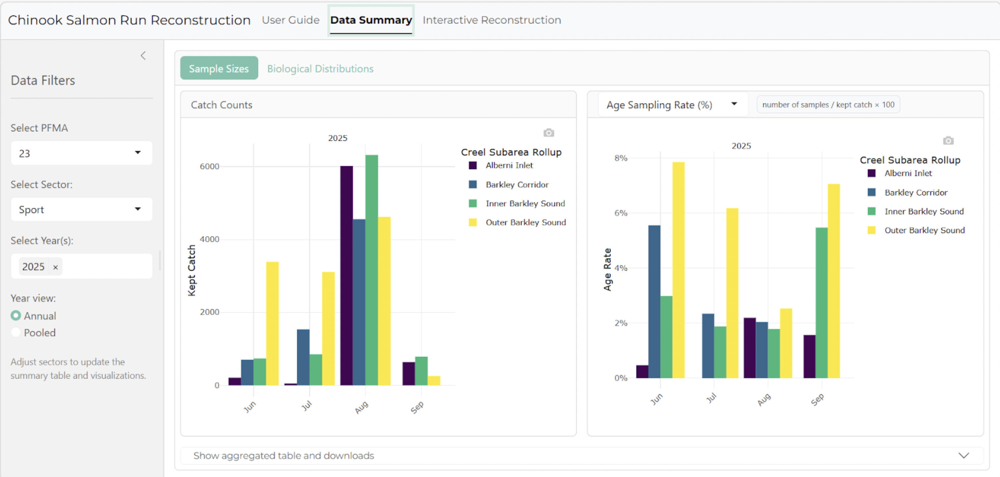

Users can select a management area, sector, and year or range of years to view catch counts alongside the number of biological samples collected for age and stock composition.

#### Tables and Downloads

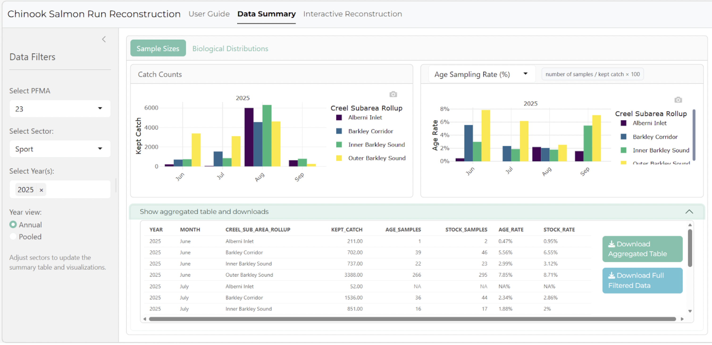

Summary tables and visualizations can be downloaded for further analysis, reporting, or record keeping.

#### Multi-Year Comparison

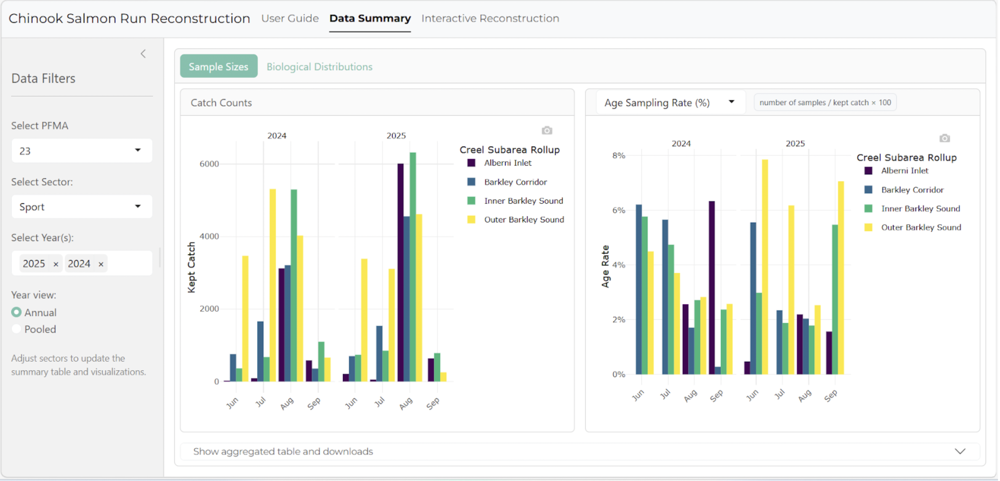

Users can compare multiple years side by side to explore changes in catch counts and biological sampling patterns over time.

#### Sampling Rate and Pooled-Year Options

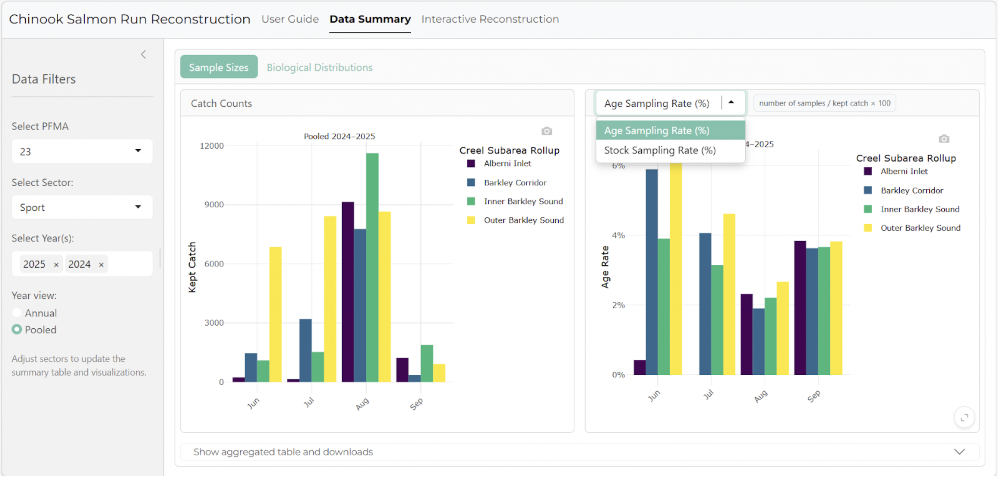

Users can pool data across multiple years and choose to display sampling rates for either age samples or stock samples.

#### Biological Distributions — Age

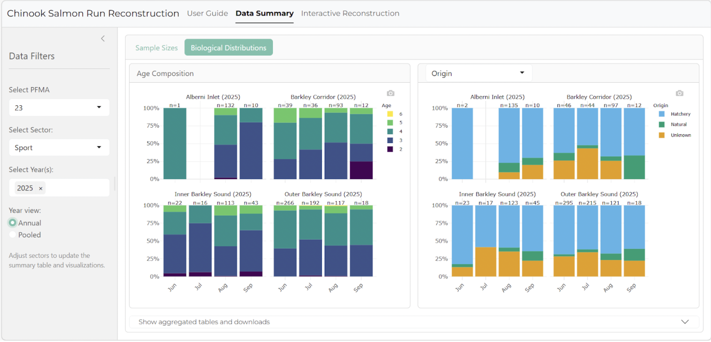

Users can explore the distribution of ages represented within the biological samples.

#### Biological Distributions — Stock

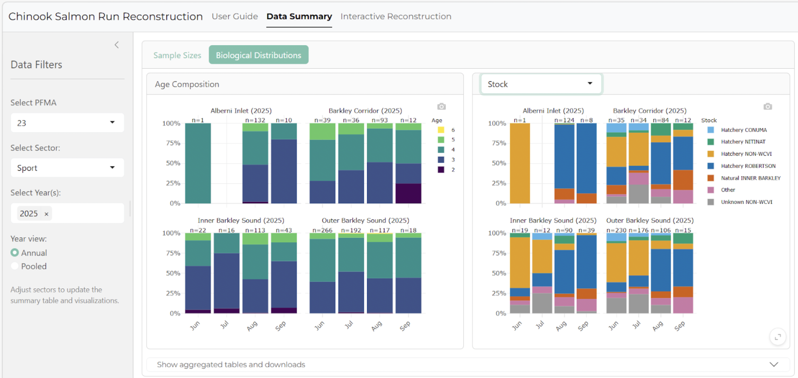

Users can similarly explore the distribution of stocks represented within the biological samples.

#### Sector-Specific Views

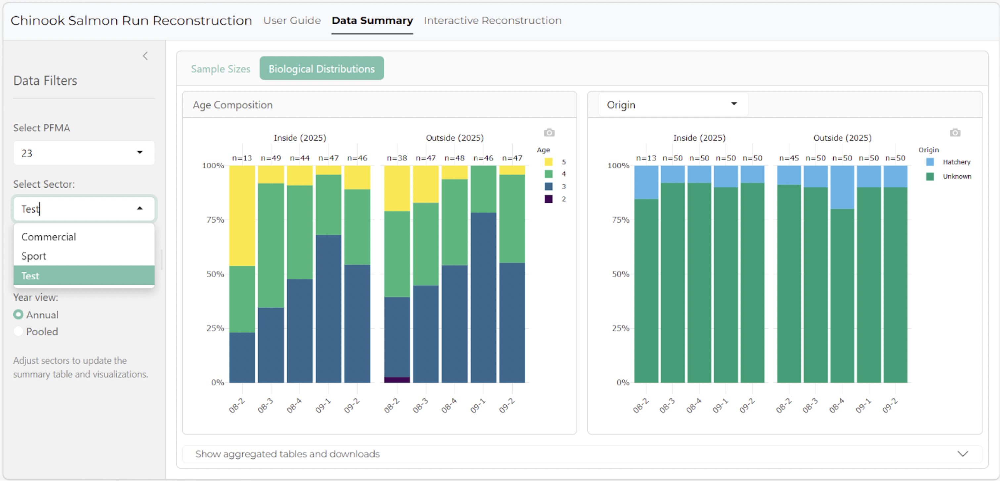

The application supports multiple reporting sectors, with users able to select and explore each sector individually using the same interactive views.

---

### Tab 3 — Data Infilling

Tab 3 provides an interactive workspace for data infilling and reconstruction. Users can identify catch strata without biological samples, select appropriate biological distributions, and apply those distributions to the relevant catch.

#### Infilling Workspace

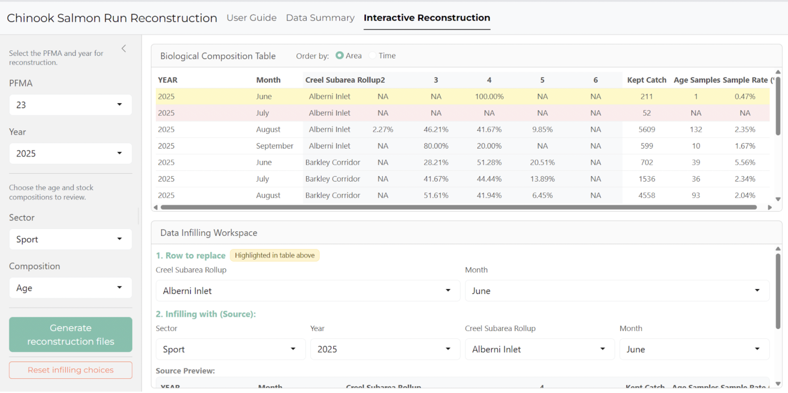

The infilling workspace highlights rows without biological samples in red, helping users identify catch strata that require an infilling decision.

#### Selecting an Infilling Decision

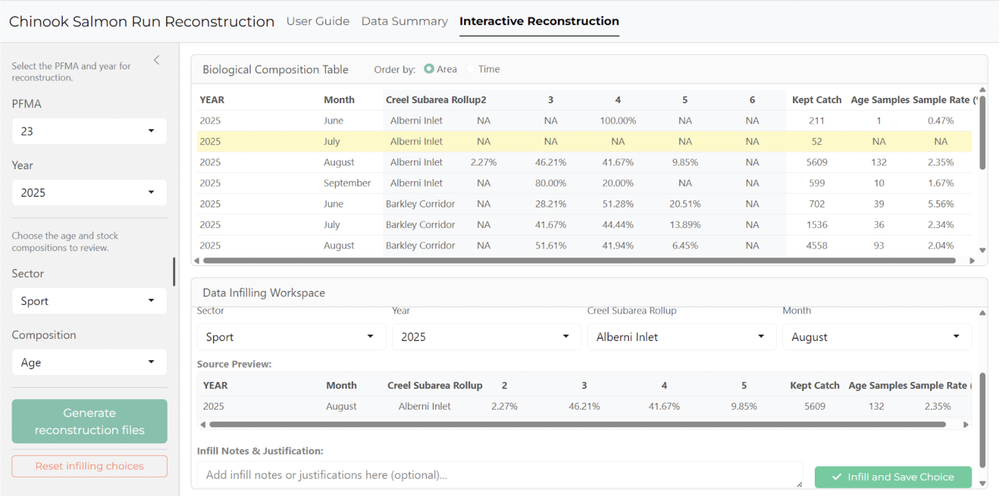

Users can select a row and choose the appropriate age and stock distributions to apply to the corresponding catch.

#### Successful Infilling

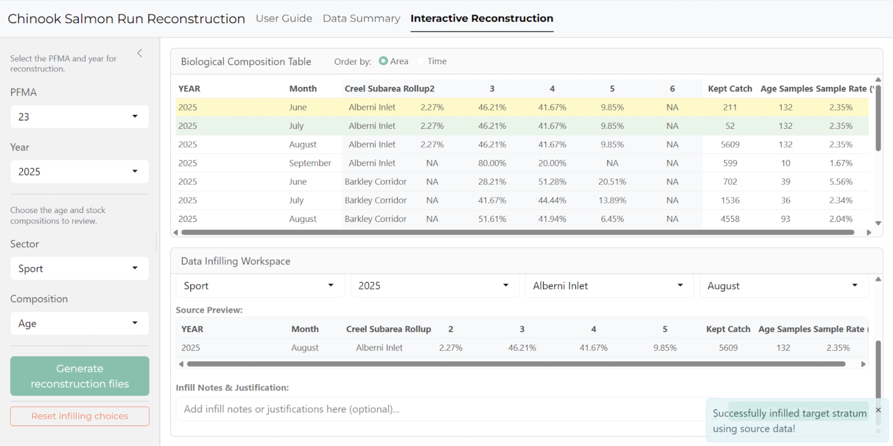

After an infilling decision is applied, the application provides a confirmation message and records the resulting decision.

## My Contributions — Claire Saunders

I contributed to the application's data processing workflows, application development, user interface design, and deployment.

### Data Processing and Analysis

* Reworked and debugged legacy biological data scripts and adapted them to the project's data processing workflow.
* Developed the biological data processing scripts used by the application.
* Developed the **multi-year and pooled-year views** in Tab 2.
* Documented the validated biological logic and assumptions embedded in the application's code.

### Application Development

* Developed **Tab 1**, including the interface, user instructions, data pipeline controls, and pipeline status feedback.
* Developed the table used in **Tab 3**.
* Contributed to the visual design and aesthetics across all three application tabs.

### Deployment and Infrastructure

* Worked with IT to establish the project within a pre-configured **Ubuntu container environment**, including identifying and requesting the software requirements needed for the application.
* Set up the project's GitHub repository and development workflow within the provided environment.
* Worked with IT to establish a **Samba share** as the project's shared data and output connection point.
* Worked with IT to configure deployment of the application directly from the container using **Shiny**.

## Technologies

The project used a combination of data science, software development, and deployment technologies, including:

* R
* Shiny for R
* renv for R package management
* Ubuntu container environment
* Git/GitHub version control
* Quarto
* Samba shared storage
* Data pipeline automation
* Interactive data visualization

## Presentation and Recognition

Our team presented the project to **three different audiences**, adapting the presentation to different levels of technical and project-specific familiarity. The project received the **Master of Data Science Audience Choice Award: Best Talk** in recognition of the presentation.

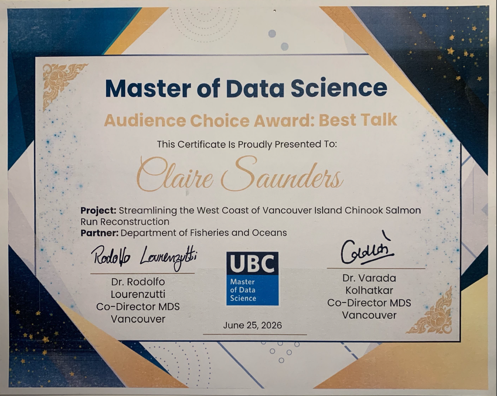{.award-image}
